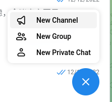
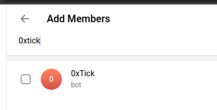
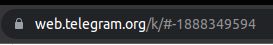
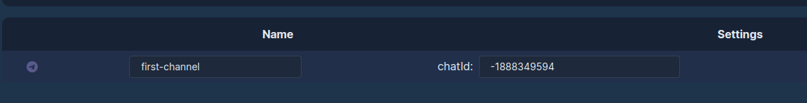
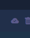
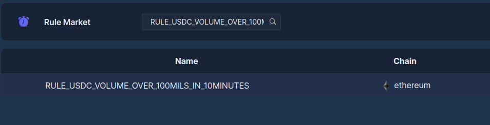
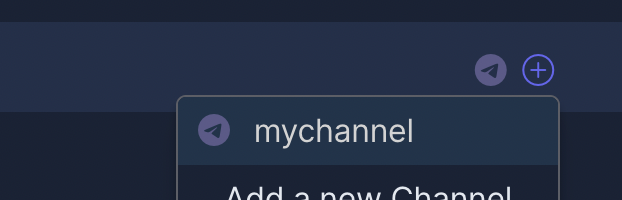

In this tutorial, we will guide to subscribe an event rule in the community via Telegram. It takes about 10 minuts to finish.

## Create a Telegram channel
### Step 1: create a group chat

* Login telegram web application (easiler to get chatId needed later on).
* Initialise a new channel.

* After creation of the channel, please invite 0xTick bot into the channel.

* Locate the chatId in the URL textbox. In this case, chatId is <b>-1888349594</b> (including negative sign).

* Open [0xTick Channels][1], click <b>ADD</b> button at upper-right corner, key in <b>Name</b> and <b>chatId</b>.

* Save the channel information by clicking the save button.

Now it is ready to use this channel to subscribe events.

## Step 2: Search for an event rule

* Open [Rule Market][2] and locate interested rule. In this tutorial we use <b>RULE_USDC_VOLUME_OVER_100MILS_IN_10MINUTES</b> as an example.

* Click <b>ADD</b> button at right-hand side to subscribe the event to the channel created.

Now you will get message sent by 0xTick once the event happens. 

[1]: <https://news.0xtick.com/channels>
[2]: <https://news.0xtick.com/rule-market>