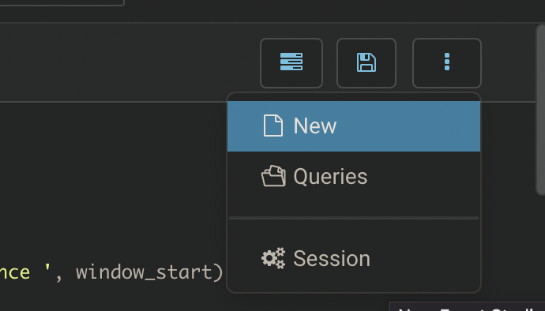
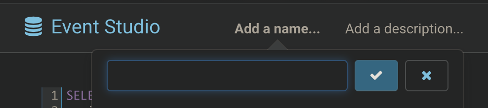
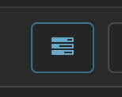

In this tutorial, we will guide you to monitor USDT trading volume in ethereum. It may take 20 mins to finish.

## Goal
Rule: If trading volume is over 100 million dollar within any 10 mins, generate an event.

Chain: Ethereum Mainnet

Token: [USDT](https://etherscan.io/token/0xdac17f958d2ee523a2206206994597c13d831ec7)

## Step 1: Design
### Data Source
Since we want to monitor USDT trading volume, each single ERC20 transfer and volume must be in hands. We need table `dwd_eth_erc20_event` which contains all ERC20 transfer along with value, block timestamp, sender and recipient.

### SQL to Event
The principle of 0xTick SQL design is <b>a non-empty result is an event</b>. 

### Logic
We simply need a SQL that aggregates transfers of USDT by every 10 mins, and filter out those total volume exceeds 100 million as non-empty results (events).

However, transfers are distributed unevenly on time axis, which requires us to introduce time window aggregation.
Let's adopt sliding window, `hop` function, to implement a moving 10-min aggregation and filter out non-empty results as events.

> If you are not familiar with window function in streaming computing, please refer to 
> [Spark Structured Streaming Window][2], [Flink Window][3].

## Step 2: Development
* Open [Event Studio][1] IDE and create a new file. 



* Type in new file name and save.



* Use the SQL below to implement the logic described previously.
```sql
SELECT 
  window_start, 
  window_end, 
  sum(cast(amount as decimal) / 1e6) as usdt_volume, 
  concat(
    '[USDT] USDT has been traded over 100 million within 10 minutes since ', 
    window_start
  )               as sys_insight, 
  'ETH'           as rule_chain, 
  'Stable Coin'   as rule_type 
FROM 
  hop(dwd_eth_erc20_event, block_timestamp, INTERVAL '2 Minutes', INTERVAL '10 Minutes') e 
WHERE e.contract_address = '0xdac17f958d2ee523a2206206994597c13d831ec7' 
AND block_timestamp > '2023-02-21 16:00:00+00:00' 
GROUP BY 
  window_start, 
  window_end 
HAVING 
  sum(cast(amount as decimal) / 1e6) > 100000000;
```

* Execute the SQL above as a dry run, and verify the result.

> LIMIT 10 is attached by system implicitly to avoid overloading.

### Time Travel
Execution of the SQL will apply the computing to full dataset, which generates historical events as a time travel, helping developers to verify the rule. However, this is not expected when deploy the SQL as a task, because you will receive all historical events once again to your channel. We encounrage developers to apply a time filter to avoid overwhelming your channels, like statement above `AND block_timestamp > '2023-02-21 16:00:00+00:00'`. 

### Output Standard
Each sql needs to have three field in order to be properly parsed via 0xTick bot in your channel.

* <b>sys_insight</b> is the short of event insight which is directly sent by 0xTick bot in channels. If you are using messaging middleware, all field selected are produced.
* <b>rule_chain</b> the chain this rule works for, helping search in rule market.
* <b>rule_type</b> the type of the rule is classified, helping search in rule market.


## Step 3: Deploy the rule 
Deploy a task requires a successful dry run, if you did not pass any dry run, the <b>Deploy</b> button will do it first.

* Click <b>Deploy</b> 



* Key in rule name which you would like to display in the rule market, and simply click <b>Submit</b>.
> If you receive any error, please report to discord support group. [Contact](../about/contact.md)

* Search your rule in rule market, and subscribe it.

[1]: <https://workspace.0xtick.com>
[2]: <https://spark.apache.org/docs/latest/structured-streaming-programming-guide.html#types-of-time-windows>
[3]: <https://nightlies.apache.org/flink/flink-docs-master/docs/dev/datastream/operators/windows/#window-assigners>